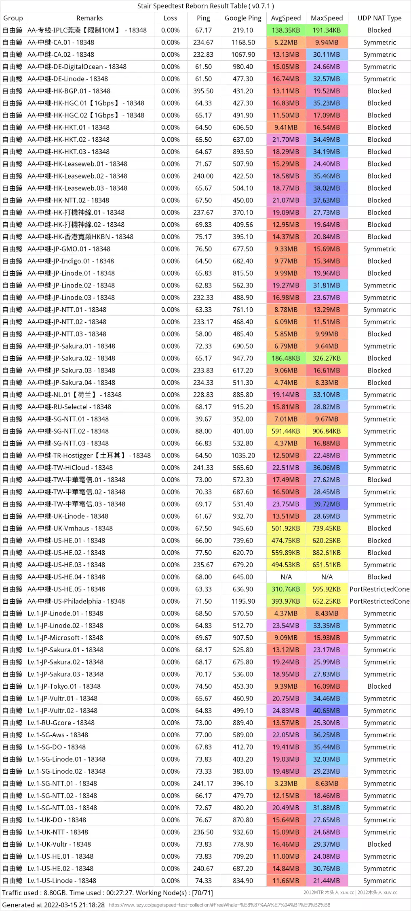

[自由鲸](https://xuv.cc/out/xin) FreeWahle，也就是原「心阶云 XinjieCloud 心阶」，是一家长期经营中高端线路的SSR/V2Ray机场，4年+平价稳定老牌[低价稳定机场](https://0xo.net/tag/low-price-ssr/)。 自由鲸目前拥有约80条遍布全球的线路节点，大量直连/CN2/BGP中继/IPLC内网专线，海外交流极速稳定，在特殊时期依然稳定坚挺。

## 心阶云跑路了吗？

并没有，改了个名字换了个域名而已。点击直达心阶云新站（自由鲸官网入口）：[「自由鲸 FreeWahle」](https://xuv.cc/out/xin)

自由鲸 简介
------

[心阶云自由鲸](https://0xo.net/tag/%e5%bf%83%e9%98%b6%e4%ba%91%e8%87%aa%e7%94%b1%e9%b2%b8/)是一家长期走中高端路线的 ShadowsocksR(SSR) 机场，也提供部分 V2Ray 线路，已经稳定运行多年。性价比相当高的，线路多，提供的流量也十分充足，主要推荐的套餐充分考虑了当前主流用户能够接受的价位，价格亲民，可以说是无可挑剔。 自由鲸现阶段包含大量优质 V2Ray 线路和更多的 SSR 线路，Lv.2 节点采用 SSR 隧道加密和 V2ray 技术，配合国内 6Gbps 机器和负载均衡技术，保证全时段稳定性。用了很久，稳定通过了 “多次网络波动” 时期，体验极佳，可以放心使用。 自由鲸一直「**被跑路**」，不过线路质量越来越好，回购用户越来越多，可以说和商家负责任的态度有很大关系。我觉得吧，姑且还是可以信任，并且价格实惠亲民，可放心购买。

### 自由鲸 封闭邀请机制

自由鲸目前使用封闭邀请机制，只有通过本站专属[邀请链接](https://xuv.cc/out/xin)，或使用博主专属[邀请码 BUtW](https://aduck.winhttps://xuv.cc/out/xin "点击复制自由鲸邀请码并直达注册") 才能成功注册，这样的注册机制一定程度确保了机场服务更加稳定。 如果需要心阶邀请码，可以使用我的邀请码：[自由鲸邀请码 BUtW](https://xuv.cc/out/xin) 自由鲸节点价格平价实惠，年付套餐更划算「**月均低至10元/月**」，可满足大部分人需求，不满意可以换其他家。但是一般很少有人换，因为线路质量对于一般用户是完全可以接受，性价比很高。

自由鲸优势特色
-------

*   采用封闭邀请机制，过滤掉一部分客户，提供更优质的服务；
*   提供有香港(HK/HKBN/CN2)、澳门(CTM)、台湾(HiNet/TFN)、日本(IIJ/NTT)、新加坡、美国(CN2 GIA/NCP)、韩国(AWS)、英国(NTT)以及国内BGP多线中转等遍布全球的优质线路；
*   Lv.2节点采用SSR隧道加密和V2ray技术，配合国内6Gbps机器&负载均衡技术，保证全时段稳定性；
*   提供价格昂贵的IPLC线路，是商业办公、游戏加速器专用的线路，延迟低，速度快；
*   自由鲸套餐流量充足，使用V2Ray&隧道中转技术，并采购商业定制隧道，中转效果超好，性价比非常高；
*   提供特有的**打机神线**，相当于网游加速器，可有效改善海外游戏的延迟；
*   全节点解锁 Netflix/DMM/HULU/TVB 等国外流媒体，流畅观看YouTube油管4K视频；
*   支持 Windows/Mac/iOS/Android/ 路由器全平台客户端；
*   超高性价比流量包，年付套餐可随时加血复活；
*   套餐种类丰富，能满足各种使用场景需求，支持订阅节点，使用方便。

自由鲸 套餐价格介绍
----------

自由鲸提供多种套餐，具体可分为：月付套餐/半年套餐/年费套餐。年付套餐不会每月重置流量，自由鲸 6666G 基本上可算是无限流量套餐。还有专门针对企业或团队用户的企业定制套餐。

[购买自由鲸套餐](https://xuv.cc/out/xin)

| 套餐             | 带宽      | 设备数量  | 流量        | 协议       | 流媒体  | 稳定性    | 价格      | 链接 |
|----------------|---------|-------|-----------|----------|------|--------|---------|----|
| A-月付 Lv.2      | 80Mbps  | 8客户端  | 130G/30天  | 全节点      | 不保证  | 保证全时段  | ￥29/月   | [购买](https://xuv.cc/out/xin) |
| A-月付 Lv.1      | 50Mbps  | 8客户端  | 70G/30天   | 无IPLC&V2 | 无解锁  | 不保证全时段 | ￥20/月   | [购买](https://xuv.cc/out/xin) |
| B-季付 Lv.2      | 100Mbps | 10客户端 | 350G/90天  | 全节点      | 不保证  | 保证全时段  | ￥78/月   | [购买](https://xuv.cc/out/xin) |
| C-年付0.5T★ Lv.2 | 200Mbps | 10客户端 | 512G/360天 | 全节点      | 保证解锁 | 保证全时段  | ￥124/年  | [购买](https://xuv.cc/out/xin) |
| C-年付1T★ Lv.2   | 350Mbps | 15客户端 | 1T/360天   | 全节点      | 保证解锁 | 保证全时段  | ￥216/年  | [购买](https://xuv.cc/out/xin) |
| C-年付2T★ Lv.2   | 500Mbps | 15客户端 | 2T/360天   | 全节点      | 保证解锁 | 保证全时段  | ￥405/年  | [购买](https://xuv.cc/out/xin) |
| C-年付团队 Lv.2    | 1Gbps   | 20客户端 | 6T+/360天  | 全节点      | 保证解锁 | 保证全时段  | ￥1076/年 | [购买](https://xuv.cc/out/xin) |
| D-高端定制 Lv.3    | 1Gbps   | 50客户端 | 9T+/365天  | 全节点      | 保证解锁 | 保证全时段  | ￥3779/年 | [购买](https://xuv.cc/out/xin) |

再次提醒：自由鲸目前使用封闭邀请机制，只有通过本站专属[自由鲸邀请链接](https://xuv.cc/out/xin)，或使用博主专属[自由鲸邀请码 BUtW](https://xuv.cc/out/xin) 才能成功注册。

自由鲸 测速情况
--------

自由鲸节点速度，可参考一下。**温馨提示：全节点测速一次要耗费10多G流量，另外频繁测速可能还会影响用户正常使用。** 

自由鲸（原心阶云） 常见问题答疑
----------------

自由鲸机场（原心阶云）常见问题答疑。

### 心阶云自由鲸年会员可以用几个客户端？

C-全年0.5T轻量【全节点/性价比】★ 限制 12 个客户端； C-全年1T中度【全节点/主流】★ 限制 15 个客户端； C-全年2T重度【全节点/尊享】★ 限制 15 个客户端； C-全年畅享套餐【全节点/团队】 限制 20 个客户端。

### 自由鲸（原心阶云）无法打开？自由鲸机场中文官网是哪个？

你懂的原因，自由鲸官网可能被屏蔽，这时候你只需要访问自由鲸官网备用网址「[点击直达自由鲸官网](https://xuv.cc/out/xin)」即可，也是自由鲸V2RAY机场中文官网。

### 自由鲸怎么样？自由鲸怎么用？

自由鲸是一家经营[超过3年](https://xuv.cc/out/xin)的老牌稳定机场，期间虽然出现过偶尔服务不稳定的情况，但是总体还是很好的。没用任何一家机场可以承诺永远一直稳定，出现偶尔不稳定是正常的，而且能持续运营3年多，足以说明其实力和稳定性还是得到了绝大多数用户的认可的。

### 自由鲸IPLC SSR邀请码怎么获得？

你只需要使用自由鲸官方自由鲸邀请码：[BUtW](https://xuv.cc/out/xin) 即可成功注册。

### 有人说自由鲸垃圾或自由鲸跑路了，是不是真的？心阶云跑路了吗？

答：心阶云跑路了吗？并没有，改了个名字换了个域名而已。点击直达新站：[「自由鲸 FreeWahle」](https://xuv.cc/out/xin) [自由鲸一直都在](https://xuv.cc/out/xin)，也没有跑路，所谓的跑路是因为很多新手小白遇到旧网址被屏蔽之后，又找不到自由鲸官网备用地址，所以认为是跑路了。 自由鲸也出现过特殊时期或不可抗力的机器故障所引起的偶尔失联的情况，这是任何一家机场都无法完全避免的，但是这种情况一般不会持久很久，很多时候是很快就恢复了。 

自由鲸（原心阶云）出现这种情况最严重的时候是SSR协议被大量精准封锁的时候，由于技术上已经被GFW精准识别，绝大多数SSR机场那时候都挂掉了。后来，自由鲸转型到SSR/V2Ray综合型机场，现在非常稳定，而且还部署了大量的隧道中继和IPLC专线，妈妈再也不用担心我偶尔失联了。 求心阶（自由鲸）的最新域名？自由鲸怎么又上不了了？？？？自由鲸又跑路了？这些问题答案请看这里自由鲸最新官网地址： **自由鲸 FreeWahle （原心阶云）备用域名 永久域名收集**

*   永久主站域名：[https://www.freewhale.co](https://xuv.cc/out/xin)
*   自由鲸官网域名：[https://www.freewhale.club](https://xuv.cc/out/xin)
*   自由鲸官网域名：[https://www.freewhale.art](https://xuv.cc/out/xin)
*   自由鲸官网域名：[https://www.freewhale.live](https://xuv.cc/out/xin)
*   自由鲸官网域名：[https://www.freewhale.digital](https://xuv.cc/out/xin)
*   自由鲸官网域名：[https://freewhale.us](https://www.freewhale.us/auth/register?code=BUtW)
*   自由鲸官网域名：[https://freewhale.shop](https://www.freewhale.shop/auth/register?code=BUtW)
*   自由鲸官网域名：[https://freewhale.xyz](https://www.freewhale.xyz/auth/register?code=BUtW)
*   自由鲸官网域名：[https://freewhale.org](https://www.freewhale.org/auth/register?code=BUtW)
*   自由鲸官网域名：[https://freewhale.pro](https://www.freewhale.pro/auth/register?code=BUtW)
*   自由鲸官网域名：[https://freewhale.site](https://www.freewhale.site/auth/register?code=BUtW)
*   自由鲸官网域名：[https://freewhale.world](https://www.freewhale.world/auth/register?code=BUtW)

### 自由鲸 优惠活动 自由鲸优惠码

2023-8-8 更新自由鲸2023年最新优惠码，2023年平价稳定机场推荐[自由鲸](https://xuv.cc/out/xin)。 通过本站专属[自由鲸邀请链接](https://xuv.cc/out/xin)注册，购买「￥124及以上套餐」可以折扣优惠码。 自由鲸2023年7月95折优惠码：[ColdMel](https://xuv.cc/out/xin)「￥124及以上套餐可用，C套餐可叠加」强烈推荐⭐套餐，月均低至10元！
